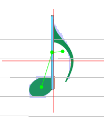
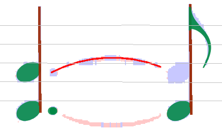
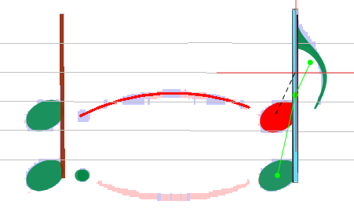
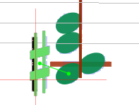
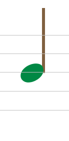

## Editing Relations

Most elements have relations to other elements. E.g. an eighth note consists of 3 elements:
The note head, the stem and the flag. You can see the relation if you select an element:

If an element lacks a needed "partner", it will be removed during normal transcription process.
In such cases it is necessary to manually add the relation.

### Add Relation

Assuming that a note head has not been recognized during analysis.

The user adds the note head, but unfortunately the program did not add the relation automatically
(normally it does!).
Then the note head will be colored in red, showing that there is an element without the relation(s)
necessary for an element of this type.

Just point and drag from note head to stem (black dotted line), and the relation will be added.

The same will be necessary for the slur to the left of the note head.
So drag from the note head to this element, too, and the correction will be done.

### Remove wrong Relations

In the following case a sharp has been linked to the wrong note head:

To remove this relation select the sharp, right-click for context menu,
select "Inters" submenu, then the sharp item and see the current relation(s) of the element.

By clicking on the relation, this relation will be removed.

Now the correct relation can be added as in the example below:

#### Implicit Remove of a Reference

In the case shown above (correcting reference of accidentals), removing of the relation
would not be necessary, because an accidental can only reference just one note head.
So the wrong relation would be removed automatically when defining a new one.
The same applies to note heads: they can only reference one stem
(if we except the specific case of a single note head _shared_ between two opposite stems).
Defining a new relation would remove the former one.

### Common Note Head for two Voices

Generally a note head (black or void) is connected to exactly one stem, as in the following example.

If head and stem are connected, both appear with their own standard color.
If not, one or both appear in red and to fix this, you can simply drag a link from one to the other.

Then, if needed, you can insert a stem on the other side of the head, in the opposite direction.

It appears in red because it can't get automatically connected to the head
(because this head is already connected on the other side).

To actually set the  connection, you have to **manually** drag a link between the (new) stem and the
head.
The program then checks if the resulting configuration is the canonical one
(which means _a stem down on left side of the head and a stem up on the right side,
the shared head being located at the end of each stem_):

* If the check fails, the new connection is set but the old one is removed.
This is the standard behavior.
* But if the check succeeds, both connections are kept and the _'shared'_ head gets logically
duplicated into two heads, one _'half'_ for the left and one _'half'_ for the right:

By selecting all components, you can see the various links (HeadStemRelation and MirrorRelation):

And if voices are colorized, the separation between head 'halves' gets even more visible:

