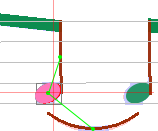
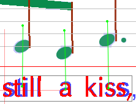

## Object Selection
{: .no_toc }

## Table of contents
{: .no_toc .text-delta }

1. TOC
{:toc}

---

### Pan and Zoom {#pan-and-zoom}

#### Moving {#moving}

The sheet image is usually larger than the window where the sheet is displayed.
You can move the display over the sheet using different means:

* By moving the scroll bars,
* By keeping the mouse left button pressed, and moving the selection point near a border of the display,
* By keeping both mouse buttons pressed, and dragging the image with the selection point.

#### Zoom {#zoom}

When modifying the zoom factor, the display will remain focused on the selected entities, if any.

It can be adjusted in the range [1:8 to 32:1] by several ways:

* By using the vertical slider located on the left side of the sheet window.
* By using the mouse wheel while keeping the **CTRL** key pressed.
* By using a rectangular "lasso" while keeping both the keys **CTRL** and **SHIFT** pressed.
When releasing the mouse, the zoom will be adjusted so that both rectangle sides get fully visible.
* By using the predefined buttons and ,
you can adjust the zoom according to the sheet's width or height, respectively.

### Selection of Objects {#selection-of-objects}

#### Selection modes {#selection-modes}

There are 3 selections modes available: **glyph**-based (the default), **inter**-based
and **section**-based.

To switch from one mode to another, use the toggle menu item `View | Switch selections`,
click on the related toolbar icon or press **F11**.

The mouse-based selection works as expected, pointing to either glyph entities or inter entities.

A selected inter may display links to its related inter entities.
The links appear as short straight lines in light green color. Images next to this paragraph depict:

1. A tuplet glyph linked to its 3 embraced chords
2. A note head connected to a stem and a slur
3. Lyrics text with links to the linked chords

|  |  |  |
| :---: | :---: | :---: |

#### Multi-selection {#multi-selection}

A left-click in an entity area selects this entity (and deselects the entity previously selected if any).

To select several entities:

* Either, by dragging the mouse while keeping the **SHIFT** key pressed, use a rectangular "lasso"
to grab all the entities whose bounds are fully contained by the lasso rectangle.

* Or, select each entity, one after the other, keeping the **CTRL** key pressed.
If you have selected an item that you did not want, simply click on it a second time
and it will be de-selected.
This can especially be useful when having selected several items using the "lasso" to then
de-select items that are not wanted.

The red rectangle shows your selection frame, while the black one shows the really selected entities.
