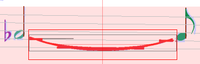
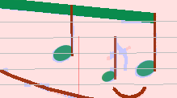
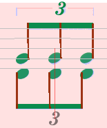
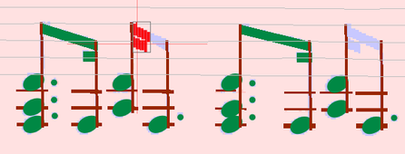

## Tips and Tricks

### Select glyphs using selection Frame

In bad scans often elements are detected as 2 or more separate glyphs (rather frequent for slurs).

In such a case, use a selection frame and try to catch all parts of the elements before you define
an inter for it:

Be sure not to select parts of other elements (e.g. augmentation dots)!

### Delete wrong interpretations before defining a new one

Before assigning another interpretation to a glyph / a group of glyphs, be sure to delete
the previous one first.
Otherwise, there will be two confusing interpretations in the output file.

### Look for missing / wrongly defined augmentation dots

The most frequent reasons for errors in the rhythm check are missing or wrongly detected
augmentation dots.
So when all obvious reasons for wrong rhythm are solved and is still in rose, zoom into the image
and look for augmentation points in the concerned measure.

### Wrongly detected grace notes

Sometimes grace notes are considered as normal notes with small head.

In such a case just delete the note and re-define with the correct interpretation
(from "ornaments" tab in Shape palette)

### Add Triplet to 2nd voice with missing "3"

Sometimes scores that contain 2 voices use a common 3 for the tuplet of both voices.

In such a case you can add the triplet element by drag-n-drop to the 2nd voice
(the fine red line shows during dragging the staff concerned):

 &gt;&gt;&gt;&gt;

### Two Note Heads with Stems in one Line

Sometimes there are two notes of two voices with stems almost on the same horizontal position.

In such a case Audiveris often does not detect the two stems as separate elements, but as one long
single stem (on which the heads will appear in abnormal positions).

You can solve the problem by adding the stems manually (ignore the grayed note head that appears
during dragging - it is only a helper to find the correct position for the stem):

Then add the note heads and you are done.

### Replace Beams with Flags

Sometimes it is not possible to define the beams correctly, because the detected glyphs
don't separate them correctly:

When trying to select the upper beam, you don't get it selected from the partial beam below.
Therefore the correct assignment of the beams with beam shapes is not possible.

In order to bypass this problem, you can assign flags instead, which can be drag-n-dropped to
the correct position instead:

The result is not strictly identical to notes with beams, but at least is leads to correct rhythm.
