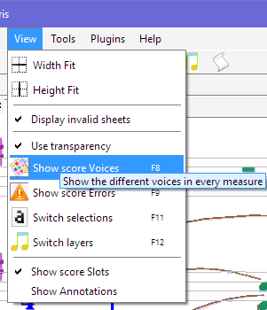
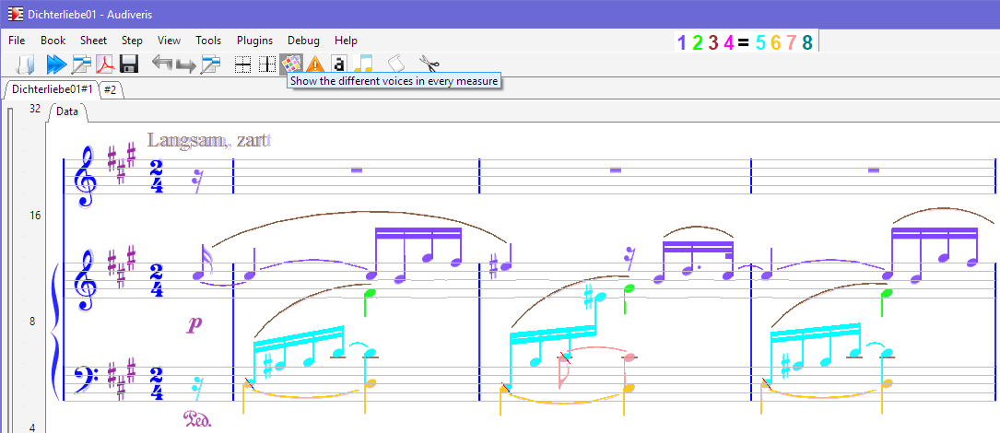

---
---
### Voice Colors

By default, each score entity is displayed using a color determined according to the entity kind:

But we can decide to focus on voices, rather than entity kinds, and thus choose to display each
entity according to its voice, if any.
This feature is reported to ease the detection of wrong voice assignment.

To do this, we can use the pulldown menu `View | Show score Voices`
(or directly the related toolbar button):

This results in the following display:

Within any given part, voice numbers (and thus colors) are assigned as follows:
* Voices starting on first staff use numbers 1 through 4,
* Voices starting on second staff use numbers 5 through 8.

#### Shared Heads

Notice that some note heads can be _shared_ between two chords.
In the example at hand, this is the case in last staff, for the starting head of each measure
except the first one.

In such canonical case, the chords involved are the chord below on left and the chord above on right.

To indicate the _shared_ aspect of such head, we add a small diagonal red segment across the head,
to indicate a logical split of the shared head.
And if voices are colorized then each head _'half'_ appears with its own voice color.
