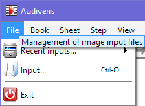

## File menu

### Recent Inputs

Gives a list of the most recent image input files.
A click on the file name opens the file as source image.

### Input

Opens a dialog box allowing to select the image or pdf-file that shall be transcribed.
The dialog pre-selects the folder from where the last input image file was loaded.

### Exit

Allows to exit Audiveris application in a civilized manner.
You will first be prompted to save or discard any unsaved modification (book, sample repository).

NOTA: **Killing** the application via an external means does **not** save unsaved modifications,
including modified options.
