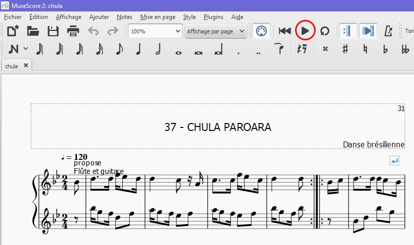

---
---
## Play

Strictly speaking, this feature is not part of Audiveris, but rather pertains to an external program
(a simple music sequencer or some high-level editor) that can work on Audiveris export,
thanks to the _de facto_ standard MusicXML exchange format.

We have simply imported the `chula.mxl` MusicXML file into MuseScore.

Note that this music editor displays the imported music correctly.
We just have to press the play button to hear the music.

This is the end of our quick tour.

For a more thorough understanding of Audiveris, you can visit the [Main Features](../main/README.md)
chapter.
