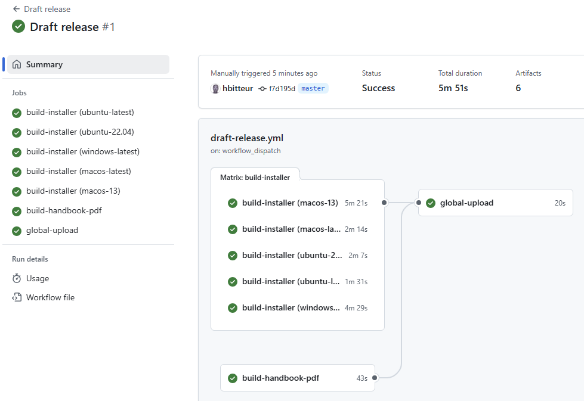
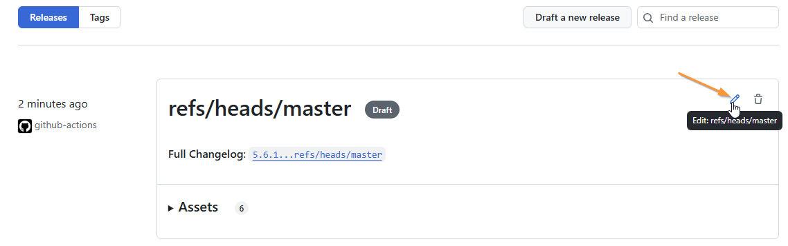
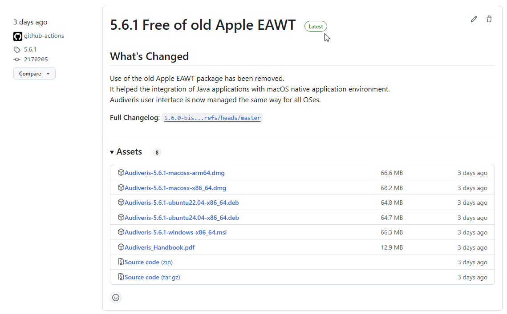

# Packaging

The `packaging` sub-project is in charge of building the OS-dependent Audiveris installer
for the OS the project is being run upon.

The GitHub workflow named `draft-release.yml` drives the building of installers for various OSes,
collects all the installers, adds a PDF version of Audiveris handbook,
and creates a draft release with all these assets.

## Most relevant files

<pre>
.
├── .github
│   └── workflows
│       └── draft-release.yml   // Workflow to draft a release
│
├── app
│   └── build.gradle            // Building Audiveris application
│
├── docs
│   └── pdf
│       ├── pdf-build.sh        // Building the PDF version of handbook
│       └── pdf-nav-style.css   // Styling for the PDF table of contents
│
└── packaging
    ├── assets                  // Images used by README.md
    ├── README.md               // This file
    ├── build.gradle            // Building an OS-dependent installer
    └── dev
        └── omr.properties      // Mapping the .omr extension to Audiveris application
</pre>

## Building an installer

Each created installer includes a (shrunk) Java Runtime Environment (JRE), the Audiveris application and all the
dependent libraries. It contains no pre-installed language file for the Tesseract library.

This approach is based on two Java tools:
- [`jlink`](https://docs.oracle.com/en/java/javase/17/docs/specs/man/jlink.html)
which assembles a set of JRE  modules and their dependencies into a custom runtime image,
- [`jpackage`](https://docs.oracle.com/en/java/javase/21/docs/specs/man/jpackage.html)
which packages a Java application into a platform-specific self-contained executable.

The implementation is driven in the `packaging/build.gradle` file by the Gradle task named `jpackage`
provided by a dedicated [jpackage-gradle-plugin](https://github.com/petr-panteleyev/jpackage-gradle-plugin)
with its specific `window`, `mac` and `linux` blocks, as follows:
1. `customJre`: task to package only the needed JRE modules
(resulting in a reduction of about 75% of the installer file size)
2. `collectJars`: task to collect the `audiveris.jar` just built, with all the jars it depends on
3. `jpackage` with os-specific actions:
    - for `Windows`: The installer type is `MSI` by default.  
    We could ask for a Windows console, if so needed. This option is OFF by default.
    - for `Linux`: The installer type is `DEB` by default.  
    The installer name conveys the Ubuntu version, that is either `20.04` or `22.04` as of this writing.
    - for `macOS`: The installer type is `DMG` by default.  
    The `macConvertIcons` task uses `imagemagick` and `iconutil` utilities
    to generate a set of Audiveris icons with differents sizes.
4. Finally, rename the resulting installer file according to:
    - the Audiveris version,
    - the OS name,
    - the OS version if needed,
    - the machine architecture,
    - the installer type.

## Packaging and publishing

### Drafting a release

The Github workflow file `draft-release.yml` launches the job `build-installer`
(which runs the `jpackage` Gradle task described above) in parallel on several machines.
As of this writing, these machines are:

| Name           | Version | Architecture |
| :---           | :---    | :--- | 
| ubuntu-latest  | 24.04   | x86_64 |
| ubuntu-22.04   | 22.04   | x86_64 | 
| windows-latest | 10      | x86_64 |
| macos-latest   | 14      | arm64  | 
| macos-13       | 13      | x86_64 |

It also launches in parallel the job `build-handbook-pdf` to generate the PDF version of the handbook.

Then, the job `global-upload` collects all the produced artifacts to create a draft release.

### Editing the release

The draft is now present in the [Releases section](https://github.com/Audiveris/audiveris/releases)
of the Audiveris repository, but since it is a draft, it is visible only by the repository authors.

We have to enter the editing mode to manually adjust this draft:
1. Set or choose a tag
2. Rename the release
3. Write comments about the main features of the release
4. Perhaps set it as a pre-release
5. Or set it as the latest release
6. Finally press the `Update release` button

At this point in time, the release is now fully visible and even referenced as the latest release.

Something like that:

